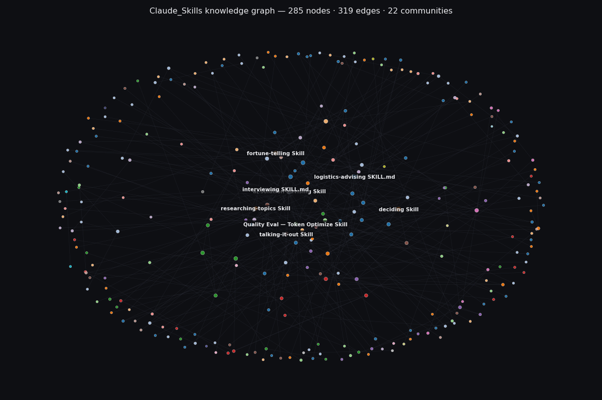

# Claude_Skills

A workspace for authoring [Claude AI Skills](https://platform.claude.com/docs/en/agents-and-tools/agent-skills) — small, triggered playbooks that get loaded into Claude's context when a relevant task comes up.

This repo holds the source folders, distributable `.skill` archives, the authoring standard, and HTML demos for each skill.

## Repository layout

```
Claude_Skills/
├── README.md            # this file
├── CLAUDE.md            # always-loaded session pointer + non-negotiables
├── STANDARDS.md         # encyclopedic authoring playbook
├── _template/           # scaffolding for new skills (SKILL.md + evals.md)
├── <skill-name>/        # one folder per skill
│   ├── SKILL.md
│   ├── evals.md
│   ├── evals/trigger-eval.json
│   └── references/      # optional, one level deep only
├── <skill-name>.skill   # distributable archive (zip of the folder)
├── <skill-name>.html    # optional public-safe HTML demo
└── graphify-out/        # knowledge graph over the repo (see § Knowledge graph)
```

## Skills in this repo

| Skill | Trigger | What it does |
|---|---|---|
| [`ai-fluency-planning/`](ai-fluency-planning/) | `/ai-fluency-planning` | Conducts a focused pre-execution interview using the AI Fluency 4D Framework (Delegation, Description, Discernment, Diligence) and produces a markdown AI Project Brief the user can reference throughout the project. Ships with trigger eval (20 cases). |
| [`ai-solution-advising/`](ai-solution-advising/) | `/ai-solution-advising` | Senior advisory across the full LLM-solution lifecycle: business framing → pattern selection → stack → failure modes → eval & ops → governance. Mode-routes by Solution-Design / Architecture / Engineering Deep-Dive / Eval-Ops / Governance and loads only the relevant references per question (19 reference files split by domain). Knowledge-currency mechanism: `references/knowledge-version.md` and `references/refresh.md` are first-class — read at session start, updated on a refresh pass. Ships with trigger eval (20 cases) and quality evals (3 mode-stress scenarios). |
| [`deciding/`](deciding/) | `/deciding` | Walks a real decision through options, criteria, trade-offs, key unknown, reversibility, pre-mortem. Recommends only when the criteria clearly favor one option. Ships with trigger eval (20 cases). |
| [`devil-advocating/`](devil-advocating/) | `/devil-advocating` | Builds the strongest case against the user's position. No balance, no recovery path. Ships with trigger eval (20 cases). |
| [`executive-lensing/`](executive-lensing/) | `/executive-lensing` | Stress-tests a problem through CEO, CFO, COO, CMO, CTO, CHRO lenses, surfacing the distinct concern each function would raise. Lens definitions split into `references/lenses.md`. Ships with trigger eval (20 cases). |
| [`explaining/`](explaining/) | `/explaining` | Gives the answer with full reasoning visible, then closes with a pattern-recognition cue for the next similar problem. Ships with trigger eval (20 cases). |
| [`fortune-telling/`](fortune-telling/) | `/fortune-telling` | Multi-tradition divination (Thai day-of-week, Chinese BaZi, Vedic, Western, Japanese Rokuyō). Picks one primary tradition + at most one cross-check; gives a verdict, not a lecture. Per-tradition cheat-sheets live in `references/` so only the chosen tradition loads per reading. For entertainment. Ships with trigger eval (20 cases). |
| [`interviewing/`](interviewing/) | `/interviewing` | Structured interview prep, design, or debrief — both sides of the table. Three modes (interviewee-prep / interviewer-design / interview-debrief) split into `references/` so only the chosen mode loads per session. Cross-cultural and remote-format calibration baked in. Ships with trigger eval (20 cases). |
| [`logistics-advising/`](logistics-advising/) | `/logistics-advising` | Diagnoses logistics and supply-chain situations through a 6-layer framework (Foundations + org/incentives → Operational execution incl. warehouse → Cross-border customs incl. audit/sanctions → Finance + trade finance → Frontier tech with vendor literacy → Strategic resilience). Sequences advice by ROI rather than novelty, names KPIs by their canonical formulas, shows landed-cost / FTA / working-capital math directionally, and flags failure modes. Strong fit for ASEAN/APEC/Thailand scenarios and project / pharma cold chain / aerospace verticals. 10 reference files split by layer for token-efficient progressive disclosure. Ships with trigger eval (20 cases) and quality evals (3 scenarios). |
| [`negotiating/`](negotiating/) | `/negotiating` | Structured negotiation prep — interests, BATNA, cognitive traps, opening and concession architecture, pre-mortem. Also auto-fires on real upcoming negotiations (salary, vendor, partnership, fundraise). Ships with trigger eval (20 cases). |
| [`quick-answering/`](quick-answering/) | `/quick-answering` | Fast minimal answer. No frameworks, no scaffolding, no caveats unless load-bearing. Ships with trigger eval (20 cases). |
| [`researching-topics/`](researching-topics/) | `/researching-topics` | Conducts substantive topic research via a six-step methodology (frame → map → plan sources → execute → synthesize → verify). Three modes (quick-scan, deep-dive, compare-options); layered output with TL;DR, confidence-labeled findings, steel-manned competing views, open questions, and sources. Ships with trigger eval (20 cases). |
| [`talking-it-out/`](talking-it-out/) | `/talking-it-out` | Warm, non-clinical companion for hard times — listens, holds space, asks gentle questions when invited, reflects without fixing. Compassion-first stance (not emotional mirroring). Mode-detects vent / process / decide. Hard exit on crisis signals; nudges toward real humans when the same struggle recurs. NOT a depression-support or therapy skill. Ships with trigger eval (20 cases, including crisis-adjacent near-misses). |
| [`thai-dish-picking/`](thai-dish-picking/) | `/thai-dish-picking` | Suggests 3 varied Thai dishes when the user can't decide what to eat. Spans regions and categories deliberately, avoids the famous-20 autopilot, searches bilingually for less-obvious dishes. Ships with trigger eval (20 cases). |
| [`token-optimizing/`](token-optimizing/) | `/token-optimizing` | Compresses prompts, RAG context, few-shot blocks, and agent loops without losing load-bearing content. Triages cache → batch → route → bound → compress → rewrite before touching the prompt. Ships with worked example, trigger eval (20 cases), and quality eval (8 cases). |
| [`working-through/`](working-through/) | `/working-through` | Coaches the user to the answer instead of giving it — provides the framework, asks them to apply it, reacts to their attempt. Ships with trigger eval (20 cases). |

## SWOT — per skill

A short read on what each skill is good at, where it falls down, where it could grow, and what could break it. Strictly about the skill's mechanics — not about who's using it.

### `ai-fluency-planning`
- **Strength** — produces a reusable artifact (the brief) that gets referenced throughout the project, not a one-shot plan; applies a published framework rather than ad-hoc structure; ships with a 20-case trigger eval.
- **Weakness** — the full interview can feel heavy on simple projects; relies on the user articulating Discernment criteria, which many people find hard upfront.
- **Opportunity** — could ship template variants for common project types (memo, code project, research synthesis); could integrate with `/deciding` for project-go/no-go gating.
- **Threat** — risk of becoming a procrastination tool — endless planning without execution. Output should commit the user to a concrete start.

### `ai-solution-advising`
- **Strength** — mode-routing (Solution-Design / Architecture / Engineering Deep-Dive / Eval-Ops / Governance) adapts response shape to the question type rather than dumping the same template every time; 19 reference files split by domain mean only the relevant slice loads per response (token-efficient progressive disclosure at the largest scale in the repo); explicit "patterns endure, tools change" framing keeps recommendations defensible past tool churn; first-class knowledge-currency mechanism (`knowledge-version.md` + `refresh.md`) names what's stale rather than fabricating confidence; ships with a 20-case trigger eval (with near-miss negatives against `/researching-topics`, `/deciding`, `/logistics-advising`, `/executive-lensing`) and a 3-scenario quality eval covering different modes.
- **Weakness** — body is the longest in the repo (≈350 lines) and the reference set is heavy; for quick tactical questions the framework can over-index. Tool-specific advice ages fast even with the refresh mechanism — between refreshes, claims about specific frameworks or vendors may be wrong. Calibration on enterprise economics, org design, and executive comms is acknowledged as a v1.3 gap.
- **Opportunity** — could chain with `/researching-topics` for the discovery half of "is this technique production-ready" questions, with `/deciding` when the question is fundamentally a build-vs-buy choice rather than an architectural one, and with `/logistics-advising` (or other domain skills) for cross-domain AI-for-X scoping. The knowledge-currency pattern (`knowledge-version.md` + `refresh.md`) could be promoted to STANDARDS as an optional pattern for fast-moving-domain skills.
- **Threat** — false precision: the depth of the framework + named parameters can read more authoritative than the framework deserves on novel architectures or fast-moving regimes (e.g., shifting AI Act enforcement). Skill must keep "patterns are durable, tools are not — verify before committing" honest, not as closing platitude. Also: the refresh workflow is only as good as it gets *run* — if cadence slips, the skill quietly becomes a liability rather than an asset.

### `deciding`
- **Strength** — six-step structure surfaces reversibility and the key unknown explicitly, not just options/criteria; only recommends when criteria clearly favor one option; ships with a 20-case trigger eval.
- **Weakness** — output quality depends entirely on whether the user articulates their criteria honestly; structured output can mask shaky inputs.
- **Opportunity** — pairs naturally with `/devil-advocating` for stress-testing the recommended option; could add domain references (hire/fire, vendor selection, acquisition).
- **Threat** — pseudo-rigor risk — the framework can make a flimsy decision look thorough without surfacing the actual hard trade-off.

### `devil-advocating`
- **Strength** — forces a steel-manned argument against the user's position; no balance, no recovery path, no hedging — the brief is the point; ships with a 20-case trigger eval.
- **Weakness** — output is intentionally one-sided; misuse as the only input would be epistemically distorting.
- **Opportunity** — best chained after `/deciding` for full stress-test cycle; could add a counter-stance parameter for unusual oppositions.
- **Threat** — emotionally taxing on value-laden personal decisions; user must be in stress-test mode, not validation mode.

### `executive-lensing`
- **Strength** — surfaces concerns from up to six functional perspectives, skipping irrelevant ones; passive trigger logic catches strategic decisions where the skill wasn't invoked explicitly; lens definitions split into a reference file (loaded only when depth is needed); ships with a 20-case trigger eval covering near-miss negatives on C-suite keywords.
- **Weakness** — lens depth depends on assumptions about each role; can collapse into vague abstractions if the user's input is thin.
- **Opportunity** — could extend with industry-specific lenses (regulatory, security, founder-investor); could pair with `/deciding` for a full strategic pass.
- **Threat** — risk of generic role-play if context lacks specifics — the lenses sound impressive while saying nothing testable.

### `explaining`
- **Strength** — pattern-recognition cue at the end makes each explanation transferable to the next similar problem, not one-off; ships with a 20-case trigger eval.
- **Weakness** — quality of the cue depends on Claude's domain depth; thin domains produce thin cues.
- **Opportunity** — could include a reference file of common patterns (logical fallacies, distributed-systems trade-offs, statistical traps) to scaffold richer cues.
- **Threat** — conflicts with `/working-through`; if both are invoked, the user is asked to pick — that friction may annoy.

### `fortune-telling`
- **Strength** — multi-tradition coverage with explicit "skip what can't be verified" honesty; for-entertainment framing is built in once-per-session, not repeated; per-tradition cheat-sheets split into `references/` so only the chosen tradition loads per reading (token efficiency at scale); ships with a 20-case trigger eval.
- **Weakness** — technical accuracy on Rokuyō and BaZi day-stems requires ephemeris/calendar lookups Claude lacks; readings rely on traditions that don't need precise computation.
- **Opportunity** — could integrate calendar/ephemeris APIs for accurate lunar and astronomical data; could chain with `/deciding` when the user is genuinely deciding rather than just asking the oracle.
- **Threat** — readers may act on predictions for high-stakes decisions despite the disclaimer; medical/legal/financial guardrails must stay firm.

### `interviewing`
- **Strength** — covers both sides of the table (candidate prep, interviewer design, post-interview debrief) with a shared structural backbone (competency → behavioral evidence → calibrated judgment); three modes split into `references/` for token-efficient progressive disclosure (only the chosen mode loads per session); cross-cultural and remote-format calibration is built-in rather than tacked on; ships with a 20-case trigger eval.
- **Weakness** — competency-based hiring research is mostly Western/large-company; some recommendations may transfer poorly to small early-stage teams or non-Western hiring norms without local calibration.
- **Opportunity** — could split out a `references/star-templates.md` with role-family-specific story templates; could pair with `/negotiating` for the post-offer side and `/deciding` for finalist-selection cases.
- **Threat** — risk of over-prepping the candidate into sounding rehearsed; the skill explicitly flags this but the failure mode is real if the user mistakes "polished script" for "ready."

### `logistics-advising`
- **Strength** — forced layer-check before recommending; sequences advice by ROI rather than novelty (so the FTA/customs leverage and warehouse-ops fundamentals beat AI/digital-twin pitches when they should); shows directional working-capital and landed-cost math rather than vibes; references a named academic canon and a canonical failure-case library to ground recommendations; 10 reference files split by layer for token-efficient progressive disclosure; ships with a 20-case trigger eval and a 3-scenario quality eval covering different layers.
- **Weakness** — body is among the longest in the repo; for someone asking a single Layer-2 tactical question, the full 7-step pass can feel heavy. Worked example uses one specific Thai-electronics-CM scenario and may not transfer cleanly to other archetypes without re-grounding.
- **Opportunity** — could ship `references/` for additional verticals (CPG-retailer OTIF, fashion returns-heavy, defense spare parts) where the canonical 6-layer template needs reshaping; could pair with `/deciding` for nearshoring or vendor-RFP cases and with `/executive-lensing` when the question is genuinely C-suite-level rather than functional.
- **Threat** — risk of false-precision: directional math + named KPIs can read more authoritative than the framework deserves on novel or fast-moving regimes (e.g., shifting tariff regimes). Skill should keep "the framework places questions cleanly but doesn't substitute for senior-practitioner wisdom" honest, not as a closing platitude.

### `negotiating`
- **Strength** — explicit positive and negative trigger cases (this is the strongest description in the repo for accurate firing); ethics check is built into the workflow rather than tacked on; ships with a 20-case trigger eval.
- **Weakness** — body is the longest of the reasoning skills; full 8-step prep is overkill for tactical mid-negotiation moments.
- **Opportunity** — could split into prep-mode and tactical-mode reference files; could add domain references (salary, vendor, fundraise) with specific anchoring guidance.
- **Threat** — analysis paralysis when timing is the actual bottleneck; skill should detect "this is moving fast" and switch to tactical mode automatically.

### `quick-answering`
- **Strength** — uncompromising brevity rule — no scaffolding, no caveats unless load-bearing; forces past default verbosity; ships with a 20-case trigger eval.
- **Weakness** — loses to mode conflicts when other skills want to add structure; can hide nuance on genuinely complex questions.
- **Opportunity** — strong companion to verbose skills — chained as a "now compress that" follow-up after a long output.
- **Threat** — misapplication on ambiguous questions risks confidently-wrong short answers; skill must flag ambiguity rather than guess.

### `researching-topics`
- **Strength** — forced six-step methodology with three modes; layered output explicitly separates fact from inference and labels each finding with a confidence level; steel-mans competing views rather than balancing them; ships with a 20-case trigger eval.
- **Weakness** — methodology overhead is wasted on simple lookups; user has to recognize when their question warrants the full treatment vs. a direct answer (the description's negative-trigger list helps but isn't perfect).
- **Opportunity** — could ship reference files for domain-specific source plans (financial, technical, regulatory, scientific); could chain with `/deciding` when the research feeds a decision; could add per-mode trigger evals.
- **Threat** — confidence labels are only as honest as Claude's calibration; over-confident "high confidence" labels on weakly-sourced findings would defeat the skill's main value proposition.

### `talking-it-out`
- **Strength** — compassion-first stance (not emotional mirroring) avoids the well-documented "reflective listening amplifies negative emotion" trap; mode-detection (vent / process / decide) keeps the skill from imposing problem-solving on a vent; explicit guardrails for crisis signals and recurring patterns built in. Ships with a 20-case trigger eval that exercises crisis-adjacent near-misses (the most safety-relevant boundary).
- **Weakness** — judgment-laden by nature; quality depends on Claude's tone calibration in the moment, which is hard to verify in advance. Pattern call-out for recurring struggles is hard to operationalize without persistent memory.
- **Opportunity** — could integrate with `/deciding` once emotional charge has settled; could add domain-specific listening notes (work conflict, relationship friction, post-conflict processing) as reference files.
- **Threat** — risk of becoming a sole emotional outlet; the skill is designed to nudge users toward real humans for recurring stuff, but enforcement depends on Claude noticing the pattern. Also: any AI listening can feel hollow to someone who needed a real human all along.

### `thai-dish-picking`
- **Strength** — bilingual search guidance (Thai + English) and explicit autopilot-avoidance rules; three worked examples baked in for diversity, full agency, and constrained modes; ships with a 20-case trigger eval.
- **Weakness** — Bangkok-availability weighting may be off for users elsewhere in Thailand or for diaspora contexts.
- **Opportunity** — could add dietary-restriction reference files (vegetarian, halal, gluten-free); could integrate with location-aware data for real-time availability.
- **Threat** — quality depends on freshness of Thai-language search results; without web search, the skill falls back to memory which over-represents the famous twenty.

### `token-optimizing`
- **Strength** — triages cache → batch → route → bound → compress → rewrite before touching the prompt; ships with both trigger eval (20 cases) and quality eval (8 cases) plus a worked example.
- **Weakness** — tokenizer estimates are approximations; non-English content needs the real tokenizer to count accurately.
- **Opportunity** — could ship reference scripts for token counting across providers; could add a per-provider pricing reference that updates as provider docs change.
- **Threat** — aggressive compression on safety-relevant content risks cutting material the original safety review depended on; skill must refuse cuts in those zones.

### `working-through`
- **Strength** — coaches the user to derive the answer rather than handing it over; matches learning-by-doing pedagogy; ships with a 20-case trigger eval.
- **Weakness** — requires user willingness to engage; not appropriate for time-pressed work or when the user simply needs the answer.
- **Opportunity** — could integrate domain-specific reasoning frameworks (debugging, math, design critique) as reference files, each scaffolding a different reasoning shape.
- **Threat** — can feel patronizing if the user wanted `/explaining` instead; skill should detect frustration signals and offer to switch.

## Authoring a new skill

The full process is in [STANDARDS.md](./STANDARDS.md). The short version:

1. Copy `_template/` to a new gerund-named folder (e.g., `summarizing-papers/`).
2. Write **`evals.md` first** — three scenarios that test the gap the skill should close. Establish baseline performance without the skill.
3. Draft `SKILL.md` to address the eval failures only. No anticipatory content.
4. Iterate on the description first (discovery), then the body (output quality).
5. Build the `.skill` archive: `zip -r <name>.skill <name>/ -x "*.DS_Store"`.

## Conventions worth flagging

- **Folder name = frontmatter `name` field = slash-command trigger = gerund form.** A skill named `deciding` is invoked with `/deciding` — one canonical string per skill.
- **`SKILL.md` body ≤ 500 lines.** Past that, split into `references/<topic>.md`, one level deep. Never nest references.
- **No secrets, anywhere.** No API keys, no `process.env`, no `.env` files, no PII — in skill files or HTML demos. This repo is public.
- **HTML demos must satisfy the public-GitHub safety contract** in [STANDARDS.md §12](./STANDARDS.md#12-html-demo-artifact--public-github-safety-contract). Single-file, runs from `file://`, no API calls to provider endpoints, no key inputs without explicit warnings.
- **Anthropic's [authoring best practices](https://platform.claude.com/docs/en/agents-and-tools/agent-skills/best-practices) supersede everything here** when they conflict.

## Knowledge graph

`graphify-out/` holds a knowledge-graph extraction over the repo — useful for spotting structural overlap between skills, surprising cross-references, and orphaned or under-connected concepts.

Latest run (2026-05-09): **285 nodes · 319 edges · 22 communities** across the 16 skills, STANDARDS, CLAUDE.md, and the reference files (~103K words, 83 files).



*Each node is a concept extracted from the repo; edges are explicit references (90%) and inferred semantic links (10%). Color = detected community. Larger nodes = higher degree. The full interactive view is in [`graphify-out/graph.html`](graphify-out/graph.html).*

### Communities by size

| Community | Nodes | | % |
|---|---:|---|---:|
| Logistics & Supply Chain | 49 | `████████████████████████` | 17.2% |
| AI Solution Advising Skill | 45 | `██████████████████████░░` | 15.8% |
| Decision & Planning Skills | 29 | `██████████████░░░░░░░░░░` | 10.2% |
| Fortune Telling & Divination | 23 | `███████████░░░░░░░░░░░░░` | 8.1% |
| Skill Authoring Standards | 17 | `████████░░░░░░░░░░░░░░░░` | 6.0% |
| Token Optimization Evals | 17 | `████████░░░░░░░░░░░░░░░░` | 6.0% |
| LLM Production Engineering | 15 | `███████░░░░░░░░░░░░░░░░░` | 5.3% |
| Document AI & Multimodal | 14 | `███████░░░░░░░░░░░░░░░░░` | 4.9% |
| Agentic Systems | 14 | `███████░░░░░░░░░░░░░░░░░` | 4.9% |
| Interviewing Skill | 14 | `███████░░░░░░░░░░░░░░░░░` | 4.9% |
| Executive Lensing Skill | 12 | `██████░░░░░░░░░░░░░░░░░░` | 4.2% |
| Emotional Support Skill | 12 | `██████░░░░░░░░░░░░░░░░░░` | 4.2% |
| ASEAN Trade & Thailand | 7 | `███░░░░░░░░░░░░░░░░░░░░░` | 2.5% |
| Skill Template Scaffold | 3 | `█░░░░░░░░░░░░░░░░░░░░░░░` | 1.1% |
| Vedic Astrology | 3 | `█░░░░░░░░░░░░░░░░░░░░░░░` | 1.1% |
| Parameter-Efficient Fine-Tuning | 2 | `█░░░░░░░░░░░░░░░░░░░░░░░` | 0.7% |
| AI Compliance & Risk | 2 | `█░░░░░░░░░░░░░░░░░░░░░░░` | 0.7% |
| Knowledge Version Management | 2 | `█░░░░░░░░░░░░░░░░░░░░░░░` | 0.7% |
| Agent Orchestration Frameworks | 2 | `█░░░░░░░░░░░░░░░░░░░░░░░` | 0.7% |
| Workspace README | 1 | `░░░░░░░░░░░░░░░░░░░░░░░░` | 0.4% |
| Skill Install Flow | 1 | `░░░░░░░░░░░░░░░░░░░░░░░░` | 0.4% |
| Model Merging | 1 | `░░░░░░░░░░░░░░░░░░░░░░░░` | 0.4% |

The two largest communities (Logistics, AI-solution-advising) reflect the most recently added skills — they pulled in the most domain vocabulary. Reasoning skills (Decision & Planning, Executive Lensing, Interviewing) cluster more tightly because their bodies are short. The single-node "communities" at the bottom (Workspace README, Skill Install Flow, Model Merging) are concepts that didn't bind strongly to any neighbor — worth checking whether they're orphaned or genuinely peripheral.

### Top 10 most-connected concepts (god nodes)

1. **ai-solution-advising Skill** — 19 edges
2. **logistics-advising SKILL.md** — 12 edges
3. **deciding Skill** — 11 edges
4. **fortune-telling Skill** — 10 edges
5. **talking-it-out Skill** — 9 edges
6. **Quality Eval — Token Optimize Skill** — 9 edges
7. **interviewing SKILL.md** — 9 edges
8. **researching-topics Skill** — 8 edges
9. **Japanese Rokuyō Reference** — 8 edges
10. **6-Layer Logistics Diagnostic Framework** — 8 edges

### What's committed

- [`graphify-out/GRAPH_REPORT.md`](graphify-out/GRAPH_REPORT.md) — readable summary: community hubs, god nodes, surprising connections (inferred edges across skills), orphan detection. Start here.
- [`graphify-out/graph.html`](graphify-out/graph.html) — interactive force-directed visualization. Open in a browser; click communities to focus, hover edges to see relations.
- [`graphify-out/graph.json`](graphify-out/graph.json) — structured graph data (nodes, edges, types, confidence levels). Author field stripped for public-repo safety.
- [`graphify-out/graph-thumbnail.png`](graphify-out/graph-thumbnail.png) — the static visualization shown above.
- [`graphify-out/cost.json`](graphify-out/cost.json) — token/cost provenance per run.
- [`graphify-out/.graphify_labels.json`](graphify-out/.graphify_labels.json) — community-name labels.

Gitignored (path leaks or machine-specific): `manifest.json`, `.chunk*_files.txt`, `.graphify_python`, `.graphify_root`, `.graphify_uncached.txt`, `cache/`. Re-running graphify on a fresh clone regenerates them locally on first run.

Re-run after meaningful changes (new skill added, major refactor, references restructured) to keep the visualization in sync.

## Installing skills from this repo

Each `.skill` file is a zip of its source folder. The exact install path depends on your Claude / Cowork setup — common flows are dropping the folder into a local skills directory, importing the `.skill` archive through the Cowork plugin UI, or syncing the folder into a plugin source repo and reinstalling the plugin.

## License

Personal authoring workspace. Skills here encode personal reasoning preferences and may not generalize. Borrow what's useful.
